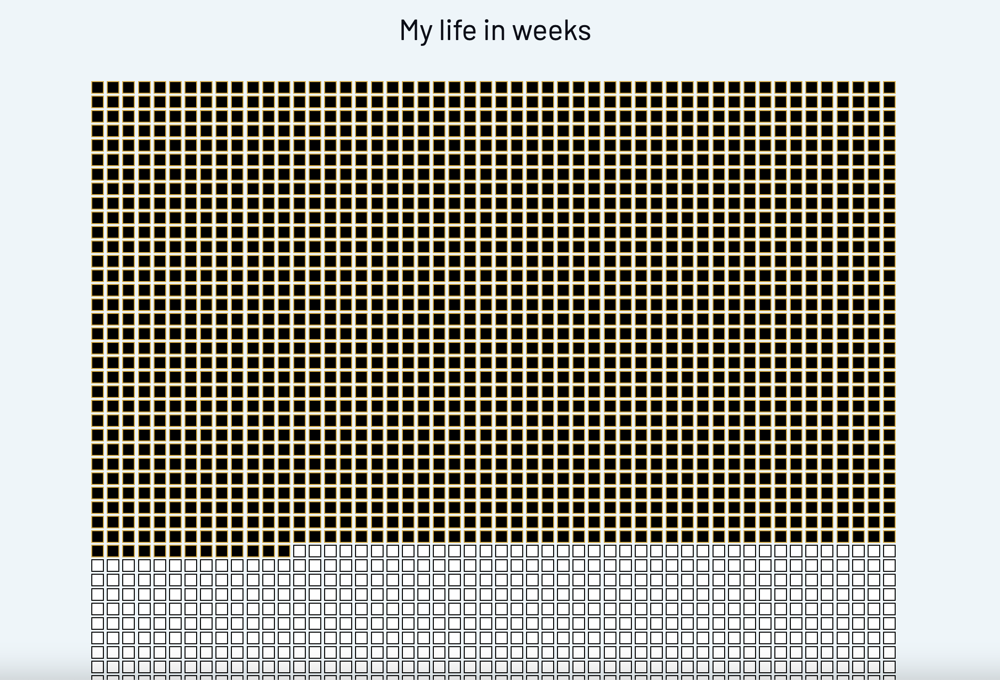

# my-life-in-weeks

## About

Recently, I came across a productivity poster that represents your entire life in squares. 

I enjoyed the clean grid design and the idea of filling in "weeks spent". 

As someone who gets a lot out of being able to see and look back on progress made, I came thiiis close to buying it. 

Then I decided to try and make it instead! This is the result ;-)

## Things Learned
